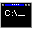

# Mason Armand
 [Visit my personal website](https://masonarmand.com)  
 [Send me an email](mailto:masonarmand@proton.me)  

 Projects

&emsp; [Experimental Game Jams](https://experimentaljams.com), website where users can upload experimental games. 
&emsp; [Tuxmino](https://github.com/masonarmand/tuxmino), game reminiscent of old arcade stackers. Custom gamemodes
  can be created with LUA. 
&emsp; [NoteWM](https://github.com/masonarmand/NoteWM), Simple X11 floating window manager. Written in C. 
&emsp; [illuscribe](https://github.com/masonarmand/illuscribe), render presentations from plaintext using a custom markup language made specifically for slideshows. 
&emsp; [ksalgo](https://github.com/masonarmand/ksalgo), C library for the Karplus Strong Algorithm. 
&emsp; [txt2web](https://github.com/masonarmand/txt2web), Simple static site generator written in C.

 Experiments

&emsp; [boids2d-rs](https://github.com/masonarmand/boids2d-rs), boids flocking simulation. My first project written in rust.  
&emsp; [gupta](https://github.com/masonarmand/gupta), roguelike game with chess based movement.  
&emsp; [karplus-string-synth](https://github.com/masonarmand/karplus-string-synth), audio playback and waveform visualization of the Karplus Strong algorithm. This project uses my ksalgo library.  
&emsp; [dungeon-game](https://github.com/masonarmand/dungeon-game), 3D dungeon crawler engine/game written in C using Raylib.

