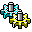

# Mason Armand
 [Visit my portfolio website](https://masonarmand.com)  
 [Visit my personal/hobby website](https://scarbyte.com)  
 [Send me an email](mailto:masonarmand@proton.me)  

 Projects

&emsp; [Experimental Game Jams](https://experimentaljams.com), website where users can upload experimental games. 
&emsp; [Tuxmino](https://github.com/masonarmand/tuxmino), game reminiscient of old arcade stackers. Custom gamemodes
  can be created with LUA. 

 Experiments

&emsp; [boids2d-rs](https://github.com/masonarmand/boids2d-rs), boids flocking simulation. My project written in rust.  
&emsp; [gupta](https://github.com/masonarmand/gupta), roguelike game with chess based movement.

